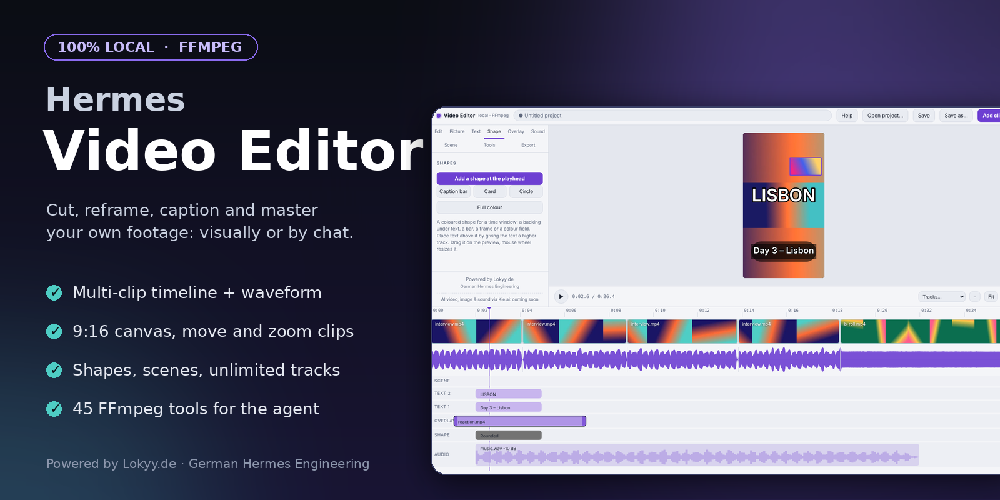
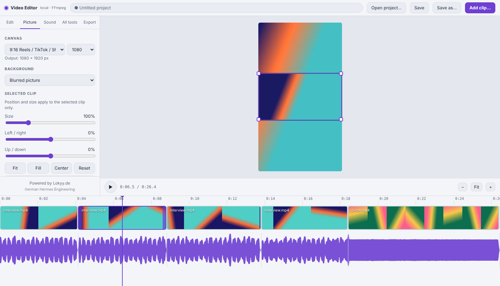

<div align="center">

[🇬🇧 English](README.md) · **🇩🇪 Deutsch**

**🚧 STATUS: BETA v0.2**



# 🎬 HERMES VIDEO EDITOR

**Ein lokaler Video-Editor für deine eigenen Aufnahmen: 42 FFmpeg-Werkzeuge für den Hermes-Agenten plus ein visueller Editor mit Ebenen.**

[](LICENSE)
[](docs/de/TOOLS.md)
[](#-sicherheit-und-offenlegung)
[](https://hermes-agent.nousresearch.com/)

*Schneide, beschneide, untertitele und mastere deine Videos per Chat oder mit der Maus. Nichts verlässt deinen Rechner.*

[Schnellstart](#-schnellstart) · [Der Editor](#-der-visuelle-editor) · [Anleitung](docs/de/GUIDE.md) · [Werkzeug-Referenz](docs/de/TOOLS.md) · [Lizenz](#-lizenz)

> Powered by [Lokyy.de](https://lokyy.de) - German Hermes Engineering

</div>

---

## Inhaltsverzeichnis

- [Warum dieses Plugin](#warum-dieses-plugin)
- [Funktionen](#-funktionen)
- [Schnellstart](#-schnellstart)
- [Der visuelle Editor](#-der-visuelle-editor)
- [Oder einfach mit Hermes reden](#-oder-einfach-mit-hermes-reden)
- [Die 42 Werkzeuge](#-die-42-werkzeuge)
- [Dokumentation](#-dokumentation)
- [Wie sich jedes Werkzeug verhält](#-wie-sich-jedes-werkzeug-verhält)
- [Problemlösung](#-problemlösung)
- [Entwicklung](#-entwicklung)
- [Sicherheit und Offenlegung](#-sicherheit-und-offenlegung)
- [Katalog-Eintrag](#-katalog-eintrag)
- [Lizenz](#-lizenz)
- [Status](#-status)

---

## Warum dieses Plugin

Die meisten „KI-Video“-Werkzeuge erzeugen Clips in der Cloud. Dieses Plugin macht die andere, alltägliche Hälfte: **Du hast das Material schon** und brauchst es geschnitten, gestrafft, auf 9:16 umgerahmt, untertitelt, in der Lautheit angeglichen und für die richtige Plattform exportiert.

Es gibt dem Hermes-Agenten 42 präzise FFmpeg-Werkzeuge und dir einen visuellen Editor (Seite in der Hermes-Desktop-Seitenleiste) mit Mehrclip-Zeitleiste, Leinwand, Video-Overlay-Spur, Text und Musik. Beide nutzen denselben Code: Was du klickst, macht auch der Agent.

> Nicht „erzeuge mir ein Video“, sondern „schneide / beschneide / untertitele / mastere **mein** Material“.

## ✨ Funktionen

- **42 Werkzeuge** für den Agenten: prüfen, schneiden und Zeit, Bild, Overlays und Text, Ton, Export und Prüfung.
- **Visueller Editor** in Hermes Desktop: Videos hineinziehen, teilen, löschen, umsortieren, kürzen, Stille entfernen, Rückgängig/Wiederholen.
- **Leinwand** 16:9, 9:16, 1:1, 4:5 mit unscharfem, schwarzem oder farbigem Hintergrund; jeden Clip frei positionieren und skalieren (ein 16:9-Clip passt in eine 9:16-Leinwand, du rahmst neu, wenn sich die Person bewegt).
- **Ebenen**: eine **Video-Overlay-Spur** (Bild-in-Bild), eine **Textebene** und eine **Audiospur** (Musik oder Sprecher mit Ein-/Ausblenden und Ducking).
- **Wellenform**, Vorschaubilder, Projekte (`.vproj.json`), Export-Voreinstellungen für Reels, TikTok, Shorts, YouTube, X und Discord sowie eine Plattform-Regelprüfung.
- **Folgt deinem Hermes-Theme** (hell/dunkel und Akzentfarbe).
- **100 % lokal**: keine Cloud, kein API-Key, keine Telemetrie. Originale bleiben unberührt.
- **Zweisprachige Doku** (Englisch und Deutsch) im Repo und im Editor (Knopf Help).

## 🚀 Schnellstart

1. **FFmpeg installieren**

   | System | Befehl |
   |---|---|
   | Linux | `apt install ffmpeg` (mit Admin-Rechten) |
   | macOS | `brew install ffmpeg` |
   | Windows | `winget install Gyan.FFmpeg` |

2. **Plugin installieren**

   ```bash
   hermes plugins install oliverhees/hermes-video-editor --enable
   ```

   Oder aus einem Klon: `git clone https://github.com/oliverhees/hermes-video-editor && cd hermes-video-editor && python scripts/install.py`.
   `install.py` ist auch innerhalb von `~/.hermes/plugins/hermes-video-editor` sicher.

3. **Prüfen**

   ```bash
   hermes plugins list
   ```

   Hermes neu starten und fragen: *„Führe lk_media_doctor aus“*. Es zeigt FFmpeg-Version, Encoder und Filter.

Später aktualisieren: `hermes plugins update hermes-video-editor`. Entfernen: `hermes plugins remove hermes-video-editor`.

## 🖥️ Der visuelle Editor



*(Echter Screenshot des Editors; das Demo-Video ist ein synthetisches Testvideo.)*

**Video Editor** in der Hermes-Desktop-Seitenleiste öffnen (Plugin unter *Capabilities -> Plugins* aktivieren, falls aus) oder in jedem Browser starten:

```bash
python scripts/editor.py                 # gibt einen Link aus und öffnet den Browser
python scripts/editor.py my-video.mp4    # mit vorgeladener Datei
```

| Das willst du | So geht's |
|---|---|
| Videos hinzufügen | **Add clip...**, **Recent** oder Dateien ins Fenster **ziehen** (mehrere auf einmal) |
| Schneiden | `S` teilen, `Entf` Clip löschen (Lücke schließt sich), `I` `O` `X` Bereich entfernen, Ränder ziehen zum Kürzen, Clips ziehen zum Umsortieren, `Strg+Z` rückgängig |
| Stille entfernen | Tab *Edit* -> **Remove silences** |
| Leinwand, Hintergrund, Position, Größe | Tab *Picture*; Bild in der Vorschau ziehen, Mausrad zoomt, **Fit / Fill / Center / Reset** |
| **Video obendrauf** | Tab *Overlay*: zweite Videospur über dem Bild (Position, Größe, Deckkraft, eigener Ton) |
| **Text** | Tab *Text*: Größe, Farbe, Umriss, Box, Vorlagen (Title, Lower third, Caption); in der Vorschau ziehen |
| **Musik / Sprecher** | Tab *Sound*: Lautstärke, Ein-/Ausblenden, Startzeit, **Ducking** (Musik wird leiser, solange das Video spricht) |
| Eines der 42 Werkzeuge | Tab *All tools*: jedes Werkzeug als Formular |
| Export | Tab *Export*: Plattform-Voreinstellung, Lautheit, Tempo, Ordner |
| Hilfe | Knopf **Help** (obere Leiste): diese Anleitung auf Deutsch oder Englisch |

So funktioniert es: Ein kleiner Webserver im Plugin hört **nur auf 127.0.0.1** (zufälliger Port, einmaliges Token). Er liefert die Editor-Seite, streamt das geöffnete Video und führt die Werkzeuge aus. Er liest und schreibt nur **Mediendateien unterhalb deines Home-Ordners** (weitere über `VE_EDITOR_ROOTS`, getrennt mit `:` bzw. `;` unter Windows).

Bekannte Grenzen: Die Vorschau spielt kein Ducking und kann Ton nicht lauter machen als die Quelle (der Export kann beides); Text sieht in der Vorschau etwas anders aus (andere Schrift); Texte, Overlays und Audio-Elemente liegen auf festen Zeiten, Schnitte an den Hauptclips verschieben sie nicht mit; eine Sprachaufnahme im Editor ist nicht möglich (der App-Rahmen hat kein Mikrofon), füge stattdessen eine aufgenommene Datei hinzu.

## 💬 Oder einfach mit Hermes reden

1. **Erst ansehen**: *„Prüfe `~/Videos/interview.mp4` und zeig mir ein Kontaktbild.“*
2. **Gesprächsvideo straffen**: *„Entferne die Stille aus `interview.mp4`, gleiche auf -14 LUFS an, brenne Untertitel ein.“*
   (`lk_remove_silence` -> `lk_transcribe_captions` -> `lk_burn_captions` -> `lk_normalize_loudness`)
3. **Reel aus einem Querformat-Clip**: *„Mach aus `trip.mp4` ein Reel: 9:16 mit unscharfem Hintergrund, Titel ‚Tag 3‘, für Reels exportieren und prüfen.“*
   (`lk_pad_blur_background` -> `lk_add_text` -> `lk_export_preset reels` -> `lk_platform_check`)
4. **Musik unter einem Sprach-Clip**: *„Schneide `podcast.mp4` von 00:12 bis 01:05 und lege `lofi.mp3` leise darunter, leiser, wenn ich spreche.“*
5. **Für Discord verkleinern**: *„Bring `clip.mp4` unter 8 MB.“* (`lk_export_preset discord_8mb` oder `lk_compress_to_size`)

Das Plugin bringt einen Skill mit, der dem Agenten die richtige Reihenfolge beibringt (erst prüfen, zuletzt die Plattform-Prüfung).

## 🧰 Die 42 Werkzeuge

| Gruppe | Werkzeuge |
|---|---|
| **A. Prüfen (5)** | `lk_media_doctor` `lk_media_probe` `lk_detect_silence` `lk_detect_scenes` `lk_extract_frame` |
| **B. Schneiden & Zeit (8)** | `lk_trim` `lk_split` `lk_join` `lk_remove_silence` `lk_remove_segments` `lk_change_speed` `lk_reverse` `lk_loop` |
| **C. Bild (9)** | `lk_crop` `lk_crop_to_aspect` `lk_resize` `lk_rotate_flip` `lk_pad_blur_background` `lk_color_adjust` `lk_denoise_video` `lk_fade_video` `lk_stabilize` |
| **D. Overlays & Text (6)** | `lk_add_text` `lk_burn_captions` `lk_add_image_overlay` `lk_picture_in_picture` `lk_stack_videos` `lk_blur_region` |
| **E. Ton (8)** | `lk_extract_audio` `lk_replace_audio` `lk_mix_music` `lk_normalize_loudness` `lk_sync_audio_offset` `lk_adjust_volume` `lk_fade_audio` `lk_denoise_audio` |
| **F. Export & Prüfung (6)** | `lk_export_preset` `lk_platform_check` `lk_compress_to_size` `lk_to_gif` `lk_contact_sheet` `lk_transcribe_captions` |

## 📚 Dokumentation

| | English | Deutsch |
|---|---|---|
| Anleitung (auch im Editor: Knopf *Help*) | [docs/en/GUIDE.md](docs/en/GUIDE.md) | [docs/de/GUIDE.md](docs/de/GUIDE.md) |
| Werkzeug-Referenz | [docs/en/TOOLS.md](docs/en/TOOLS.md) | [docs/de/TOOLS.md](docs/de/TOOLS.md) |
| README | [README.md](README.md) | diese Datei |
| Entwurfsnotizen | [docs/NOTES.md](docs/NOTES.md) (EN) | |

## 🔧 Wie sich jedes Werkzeug verhält

- **Ergebnis**: ein JSON-Text. Erfolg: `{"ok": true, "output": "<Pfad>", "duration_s": <Sekunden der AUSGABE>, "info": {...}}`. Fehler: `{"ok": false, "error": "...", "hint": "...", "ffmpeg_stderr_tail": "..."}`. Werkzeuge werfen nie Ausnahmen.
- **Ausgabenamen**: `<Eingabename>_<op>.<ext>` neben der Eingabe, in `output_dir` oder genau `output`. Existiert die Datei, entsteht `_1`, `_2` … außer bei `overwrite=true`. Die Eingabedatei ist nie als Ausgabe erlaubt.
- **Zeiten**: `12.5`, `01:30` oder `00:01:30.250`. **Zeitlimit**: `timeout_s` (Standard 600); danach wird FFmpeg beendet.
- **Stumme Clips** und **ungerade Größen** werden behandelt. **Pfade** mit Leerzeichen und Umlauten funktionieren (Argumentlisten, keine Shell).
- **Schriften**: `lk_add_text` nutzt `font_file`, dann `VE_FONT`, dann eine Systemschrift (DejaVu/Liberation, Helvetica/Arial, `arial.ttf`). `lk_media_doctor` zeigt die gewählte.
- **Plattformregeln** stehen in [`platform_rules.py`](platform_rules.py) (ein änderbares Dict). **Aktuelle Plattform-Limits selbst prüfen**: Plattformen ändern sie ohne Ankündigung.
- **Optional Untertitel aus Sprache**: `pip install faster-whisper` und ein bereits lokal vorhandenes Modell. Das Plugin lädt nie etwas herunter.

## 🩺 Problemlösung

| Symptom | Lösung |
|---|---|
| `ffmpeg not found on PATH` | FFmpeg installieren, Hermes/Terminal neu starten, `lk_media_doctor` ausführen. |
| `no 'drawtext' / 'subtitles' filter` | Deinem FFmpeg fehlt freetype/libass. Vollständigen Build installieren (Windows: Gyan „full“). |
| `Not a readable media file` | Defekt, noch im Schreiben oder kein Medium. Erst mit dem Prüf-Werkzeug ansehen. |
| Text fehlt / Kästchen statt Buchstaben | `font_file` mit passender Schrift angeben oder `VE_FONT` setzen. |
| `timed out` | `timeout_s` für große Dateien erhöhen. |
| `Could not reach X MB` | Ziel zu klein für die Länge: Clip kürzen oder `target_mb` erhöhen. |
| Kein „Video Editor“ in der Seitenleiste | Unter *Capabilities -> Plugins* aktivieren, Hermes-Profil prüfen, App neu starten. Prüfen, ob `~/.hermes/desktop-plugins/hermes-video-editor/plugin.js` existiert (`python scripts/install.py`). |
| Editor-Seite meldet „could not start“ | `hermes plugins list` muss es aktiv zeigen. Ersatz: `python scripts/editor.py`. |
| „Preview unavailable“ | Die Vorschau braucht H.264 oder VP8. Schneiden und Export gehen trotzdem. |

Mehr in der [Anleitung](docs/de/GUIDE.md#12-probleme-lösen).

## 🛠️ Entwicklung

```bash
python -m pip install pytest
python -m pytest -q                  # braucht ffmpeg; baut winzige synthetische Medien, kein echtes Material
python scripts/sync_manifest.py      # plugin.yaml nach Hinzufügen/Entfernen eines Werkzeugs neu erzeugen
python scripts/gen_docs.py           # docs/en/TOOLS.md und docs/de/TOOLS.md neu erzeugen
```

Aufbau: `core/` (FFmpeg-Runner, Pfade, Zeit-Parser, Ergebnisse), `tools/` (ein Modul pro Gruppe), `schemas.py` (die eine `TOOLS`-Tabelle), `skills/video-editor/SKILL.md`, `editor/` (lokaler Server + Web-Oberfläche), `dashboard/` (Backend-Route für die Desktop-Seite), `desktop/` (Desktop-Seite), `tests/`, `docs/`.
Optionale Extras für den vollen Testlauf: `pip install fastapi httpx playwright` (diese Tests werden sonst übersprungen). CI läuft auf Ubuntu, macOS und Windows.

## 🔒 Sicherheit und Offenlegung

- Startet `ffmpeg` / `ffprobe` als Unterprozesse mit Argumentlisten (`shell=False`), nur auf Dateien, die du nennst.
- Kein ausgehender Netzwerkzugriff, keine Telemetrie, keine Selbst-Updates, keine Downloads, keine Zugangsdaten gelesen, keine Hooks, keine Überschreibung des Kerns. Die Agentenseite nutzt nur `register_tool` und `register_skill`.
- Der Editor startet einen **lokalen Listener auf 127.0.0.1** (zufälliger Port, einmaliges Token, Host-Header geprüft, CORS nur offen, weil der Sandbox-Frame einen opaken Origin hat, Zugriff auf Mediendateien unterhalb deines Home-Ordners begrenzt). Er startet bei Bedarf und endet mit dem Prozess.
- Legt Vorschau-Caches (kleines Proxy-Video, Wellenform, Vorschaubilder) im Temp-Ordner unter `hermes-video-editor-cache` ab.
- Liest deine Eingabedateien und schreibt neue Dateien (Ausgaben plus kurzlebige Temp-Dateien).
- Die in `plugin.yaml` deklarierten Fähigkeiten werden aus den echten Registrierungen erzeugt und per Test geprüft.

## 🏷️ Katalog-Eintrag

Banner, „Repository“-/„Documentation“-Links, „Requires Hermes“ und „Reviewed commit“ auf offiziellen Plugin-Karten stammen aus einem Katalog-Eintrag. Erzeuge deinen mit `python scripts/make_catalog_entry.py` (fixiert den Commit und verlinkt die Doku), prüfe mit `hermes plugins validate . --install-deps` und öffne dann einen PR an `NousResearch/hermes-agent`, der ihn als `plugin-catalog/hermes-video-editor.yaml` hinzufügt.

## 📜 Lizenz

**[PolyForm Noncommercial License 1.0.0](LICENSE)**: frei nutzbar, studierbar, änderbar und weitergebbar für **nicht-kommerzielle** Zwecke (private Projekte, Hobby, Bildung, Forschung, gemeinnützige Organisationen). **Kommerzielle Nutzung ist unter dieser Lizenz nicht erlaubt.** Für kommerzielle Nutzung frage über [Lokyy.de](https://lokyy.de) nach einer separaten Lizenz.

Hinweis: Das ist eine *Source-Available*-Lizenz, keine von der OSI anerkannte Open-Source-Lizenz.

## 🔧 Status

Beta. Die 42 Werkzeuge und der Editor sind durch eine automatische Testsuite abgedeckt (Unit-, FFmpeg-Integrations- und echte Browser-Tests). Noch nicht auf jeder Hermes-Desktop-Version geprüft; getestet gegen Hermes Desktop 0.21.5. Geplant: weitere Overlay-Funktionen und ein optionales separates Plugin für KI-Erzeugung.

---

Powered by [Lokyy.de](https://lokyy.de) - German Hermes Engineering
